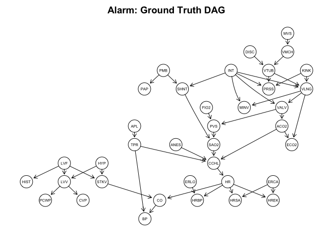
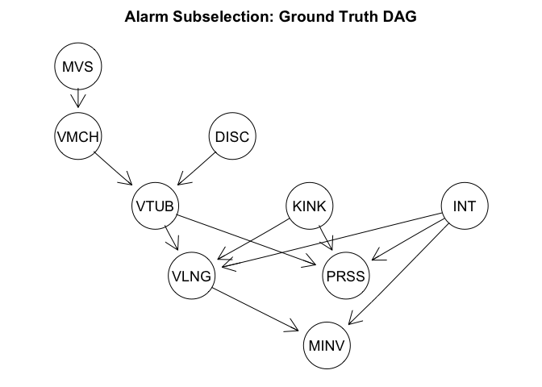
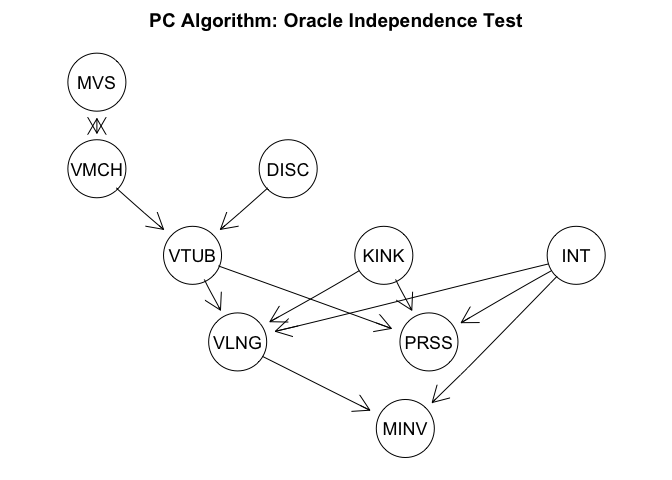
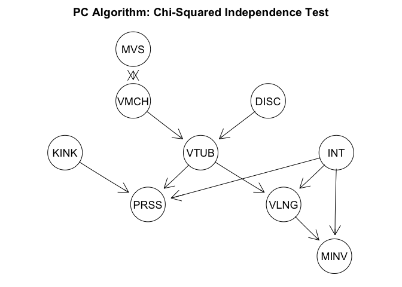
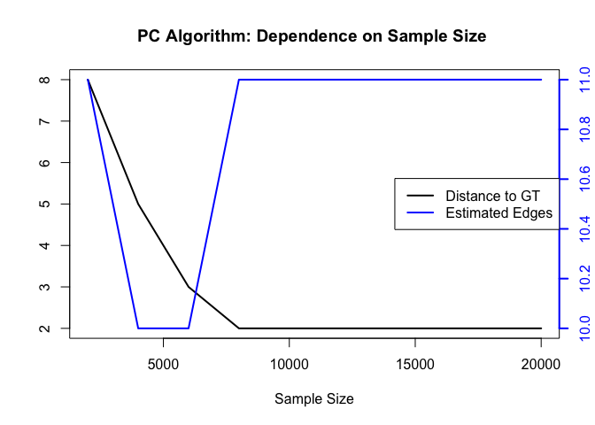

# PC Algorithm for Causal Discovery

This notebook presents and applies the structure learning PC algorithm
on the alarm dataset. The PC algorithm was introduced by Peter Spirtes
and Clark Glymour \[1\] to infer a graphical structure to a
distribution. (Conditional) independencies hold in the distribution if
paths in the associated graph are blocked (d-separation). The converse
statement is called faithfulness. The PC algorithm starts with a
complete graph and removes edges by testing (conditional)
independencies. The key assumption of the PC algorithm is that all
revelant and influencing variables are measures, a.k.a. ’no unmeasured
confounding. Directed edges encode causality, a non-symmetric
generalization of conditioning.

## Loading the Alarm Dataset and its DAG

We apply the algorithm on the alarm dataset \[2\] of size 37 x 20,000.
It can be downloaded from the Zenodo ‘Graphical Modelling and Causal
Inference’ (<https://zenodo.org/records/14793281)> community under the
[CC0](https://creativecommons.org/publicdomain/zero/1.0/deed.en)
License.

``` r
library(zen4R) # download files from Zenodo
library(bnlearn) # read ground truth graph
library(pcalg) # PC Algorithm implementation
library(Rgraphviz) # plot graphs
library(MVN) # multivariate normal test
```

``` r
# Load Data
zenodo <- ZenodoManager$new(logger = NULL)
record <- zenodo$getRecordByDOI("10.5281/zenodo.14793281")
files <- record$listFiles(pretty = TRUE)

alarm <- as.matrix(read.csv(files[2, 4]))
temp_bif <- tempfile(fileext = ".bif")
download.file(files[1, 4], temp_bif, mode = "wb")
graph <- as.graphNEL(read.bif(temp_bif))

# Preprocessing
alarm <- as.matrix(read.csv(files[2, 4]))

alarm[alarm == "FALSE"] <- 0
alarm[alarm == "TRUE"] <- 1
alarm[alarm == "ZERO"] <- 0
alarm[alarm == "LOW"] <- 1
alarm[alarm == "NORMAL"] <- 2
alarm[alarm == "HIGH"] <- 3
alarm[alarm == "ONESIDED"] <- 3 # Variable INT: NORMAL < ONESIDED < ESOPHAGEAL
alarm[alarm == "ESOPHAGEAL"] <- 4
alarm <- apply(alarm, 2, as.numeric)
alarm <- apply(alarm, 2, function(x) x - min(x))
```

The underlying ground truth directed acyclic graph (DAG) is given in the
plot below. It is the DAG visualizing the structural equation model
generating the observational dataset. All collumns represent patient
measurements and status of clinial treatment machines.

``` r
A <- amat(read.bif(temp_bif))
alarm_names <- c("HIST", "CVP", "PCWP", "HYP", "LVV", "LVF", "STKV", "ERLO", 
                 "HRBP", "HREK", "ERCA", "HRSA", "ANES", "APL", "TPR", "ECO2", 
                 "KINK", "MINV", "FIO2", "PVS", "SAO2", "PAP", "PMB", "SHNT", 
                 "INT", "PRSS", "DISC", "MVS", "VMCH", "VTUB", "VLNG", "VALV", 
                 "ACO2", "CCHL", "HR", "CO", "BP")
colnames(A) <- alarm_names
rownames(A) <- alarm_names
ground_truth <- as(A, "graphNEL")
amat_gt <- as(ground_truth, "matrix")
pcalg::plot(ground_truth, main = "Alarm: Ground Truth DAG")
```



For demonstration purposes, we restrict the dataset to the ancestral set
of ‘MINV’. Note that the number of DAGs on n nodes grows
super-exponentially (<https://oeis.org/A003024)> and that there are more
than 800 Billion DAGs on 9 node.

``` r
sub_names <- c("MVS", "VMCH", "DISC", "VTUB", "PRSS", "KINK", "VLNG", "INT", 
               "MINV")
sub_alarm <- alarm[, sub_names]
sub_gt <- as(A[sub_names, sub_names], "graphNEL")
amat_sub_gt <- as(sub_gt, "matrix")
pcalg::plot(sub_gt, main = "Alarm Subselection: Ground Truth DAG")
```



### PC Algorithm: Oracle Conditional Independence Test

Without further assumptions, it is not possible to identify the
presented DAG, which is why the PC algorithm returns a completed
partially directed acyclic graph (CPDAG). Each CPDAG represents a class
of DAGs where the undirected edges have to be appropriately directed.
The following code chunk gives the best possible PC algorithm outcome by
taking the implied condition independencies from the graph above instead
of testing any hypothesis.

``` r
ci_test_dsep <- function(ground_truth, var_names) {
  function(x, y, S, suffStat) {
    is_indep <- dsep(var_names[x], var_names[y], var_names[S], ground_truth)
    return(as.numeric(is_indep))
  }
}

pc_oracle_fit <- pc(suffStat = list(),indepTest = ci_test_dsep(sub_gt, sub_names),
  alpha = 0.5,  # irrelevant since ci_test_dsep() returns either 0 or 1
  labels = sub_names)
plot(pc_oracle_fit@graph, main = "PC Algorithm: Oracle Independence Test")
```



This returned CPDAG is very similar to the ground truth DAG. Only the
edge between ‘MVS’ and ‘VMCH’ can not be oriented. One criterion to
quantify the distance between CPDAGs is to calculate the 1-norm of the
corresponding adjacency matrices.

``` r
distance_to_gt <- function(fit, amat_gt) {
  amat_est <- as(fit@graph, "matrix")
  amat_est <- amat_est[rownames(amat_gt), colnames(amat_gt)]
  sum(abs(amat_gt - amat_est))
}
distance_to_gt(pc_oracle_fit, amat_sub_gt)
```

    [1] 1

## PC Algorithm: Chi-Squared Independence Test

As our data is discrete with at most 4 levels, we choose the Chi-Squared
independence test as the criterion to remove edges with the PC
algorithm. Any rank test allowing for two discrete variables is possible
as well. If the data is continuous and normal, ‘gaussCItest’ can be
selected. A non-parametric, however computationally more demanding,
alternative by kernel testing with, e.g., the ‘dHSIC’ package.

``` r
suffStat <- list(dm = as.data.frame(sub_alarm), nlev = apply(sub_alarm, 2, function(x) length(unique(x))), adaptDF = FALSE)
pc_fit <- pc(suffStat,
             indepTest = disCItest,
             alpha = 0.01,
             labels = sub_names)
pcalg::plot(pc_fit, main = "PC Algorithm: Chi-Squared Independence Test")
```



We selected the alpha value to be 0.01 as the threshold to compare
p-values against. The returned CPDAG is missing the connection between
“KINK” and “VLNG” but is otherwise correct. Hence, we were able to
nearly recover the correct structure from 20,000 samples. Whether
missing an edge or estimating an irrelevant one is worst is use-case
specific. Usually however, we recommend overestimating the graph and
pruning edges via auxiliary experiments in a later stage. This is
specified by the alpha value, where a smaller alphas return denser
graphs.

## PC Algorithm: Dependendce on Sample Size

To demonstrate the behavior of increasing testing power, we scale the
dataset and visualize the distance of the estimated graph to the ground
truth. Note that the lower bound is 1 given by the oracle PC algorithm.

``` r
sample_size <- seq(2000, 20000, by = 2000)
dist_to_gt <- c()
n_est_edges <- c()
for (i in 1:length(sample_size)) {
  suffStat <- list(dm = as.data.frame(sub_alarm[1:sample_size[i], ]), nlev = apply(sub_alarm, 2, function(x) length(unique(x))), adaptDF = FALSE)
  pc_fit <- pc(suffStat, indepTest = disCItest, alpha = 0.01, labels = sub_names)
  amat_est <- as(pc_fit@graph, "matrix")
  amat_est <- amat_est[sub_names, sub_names]
  dist_to_gt <- c(dist_to_gt, distance_to_gt(pc_fit, amat_sub_gt))
  n_est_edges <- c(n_est_edges, sum(amat_est))
}

plot(sample_size, dist_to_gt, type = "l", xlab = "Sample Size", ylab = "",
     main = "PC Algorithm: Dependence on Sample Size ", lwd = 2)
par(new = TRUE)
plot(sample_size, n_est_edges, type = "l", axes = FALSE, xlab = "", ylab = "",
     col = "blue", lwd = 2)
axis(side = 4, col = "blue", col.axis = "blue", lwd = 2)
legend("right", legend = c("Distance to GT", "Estimated Edges"),
       col = c("black", "blue"), lty = 1, lwd = 2)
```



The plot indicates a very good estimation performance from 8,000 samples
onwards. When estimating causal effects in a second stage, we recommend
data splitting to prevent information leakage.

Finally, the ‘pcalg’ package also supports a ‘skeleton’ function. This
skips the second, edge orienting phase and returns an undirected graph.
Several applications are solely interested in modeling a joint
distribution. By leveraging the obtained independencies, the joint
distribution can be expressed and estimated via a product of
lower-dimensional distributions decreasing the computational complexity.

# References

\[1\] Spirtes, P., Glymour, C. N., Scheines, R., & Heckerman, D. (2000).
Causation, prediction, and search. MIT press.

\[2\] Beinlich I, Suermondt HJ, Chavez RM, Cooper GF (1989). “The ALARM
Monitoring System: A Case Study with Two Probabilistic Inference
Techniques for Belief Networks”. Proceedings of the 2nd European
Conference on Artificial Intelligence in Medicine, 247–256.
